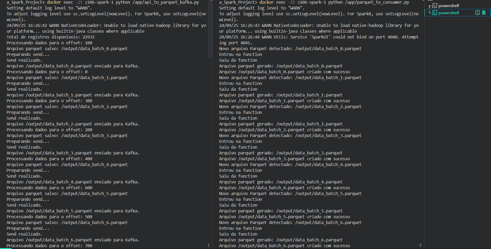

---

# Projeto: Extração de Dados via API para Streaming com Kafka e Spark

## Descrição do Projeto

Este projeto tem como objetivo construir um pipeline de processamento de dados em tempo real (streaming) utilizando Apache Kafka e Apache Spark. A aplicação extrai dados de uma API pública, salva os dados em arquivos no formato Parquet, envia esses arquivos para o Kafka, e posteriormente um consumidor lê esses arquivos, realiza transformações para normalização dos dados e armazena o resultado novamente em Parquet.

O foco principal é o uso de tecnologias modernas de processamento de dados e streaming, simulando um fluxo contínuo de dados que pode ser escalado para grandes volumes.

### Principais Componentes do Projeto:

1. **API Pública**: Origem dos dados que serão processados.
2. **Apache Kafka**: Middleware que permite a comunicação assíncrona entre os componentes do sistema (produtores e consumidores).
3. **Apache Spark**: Framework usado para processar os dados e executar transformações complexas, além de converter formatos de dados (Parquet para Parquet ajustado).
4. **Docker**: Ferramenta de containerização que garante que o ambiente de desenvolvimento seja replicável e isolado.
5. **Zookeeper**: Utilizado para coordenação e gerenciamento do Kafka.
6. **Streamlit**: Ferramenta para criação de aplicações web interativas que permite a visualização em tempo real dos dados processados, facilitando a análise e o monitoramento dos resultados de forma amigável e acessível.
7. **Poetry**: Ferramenta para gerenciamento de dependências e ambientes virtuais, garantindo a consistência e a reprodutibilidade do ambiente de desenvolvimento.

## Arquitetura do Projeto

A estrutura do projeto envolve dois scripts principais que trabalham em conjunto para realizar o fluxo de dados:

1. **Produtor de Dados (API para Parquet via Kafka)**: Extrai dados de uma API pública, salva-os em formato Parquet e envia as referências dos arquivos para o Kafka.
2. **Consumidor de Dados (Parquet para Parquet ajustado)**: Escuta o tópico Kafka, consome os arquivos Parquet, ajusta os dados e armazena o resultado em novo Parquet.
3. **Interface de Visualização (Streamlit)**: Uma aplicação web que se conecta ao sistema para visualizar os dados processados em tempo real, permitindo aos usuários monitorar e analisar os resultados de forma interativa e amigável.

Esses componentes se comunicam via tópicos no Kafka, criando um pipeline de processamento assíncrono que simula um fluxo de dados em tempo real. O Streamlit complementa esse fluxo ao fornecer uma interface visual para a exploração dos dados, facilitando a tomada de decisões informadas.

## Estrutura de Arquivos

```
├── output                     # Diretório onde os arquivos Parquet serão armazenados
├── spark-app                  # Scripts Python para processamento de dados
│   ├── api_to_parquet_kafka.py      # Extrai dados da API, salva como Parquet e envia ao Kafka
│   └── Dockerfile                   # Configuração das imagens dos containers, instalação de dependências definidas em requirements.txt
│   └── parquet_to_consumer.py       # Lê do Kafka, realiza transformações e converte/sobrepõe em Parquet
│   └── parquet_to_csv_consumer.py   # Lê do Kafka e converte Parquet em CSV
│   └── requirements.txt             # Dependências do docker Spark
├── docker-compose.yml         # Orquestração dos containers Kafka, Zookeeper e Spark
├── pyproject.toml             # Arquivo de configuração do Poetry
├── README.md                  # Instruções e informações do projeto
├── streamlit.py               # Aplicação Streamlit para monitoramento em tempo real dos arquivos
```

## Tecnologias Utilizadas

- **Apache Kafka**: Streaming e gerenciamento de mensagens entre serviços.
- **Apache Spark**: Processamento distribuído e conversão de dados em larga escala.
- **Docker**: Criação de ambientes isolados e consistentes para execução dos serviços.
- **Python**: Linguagem de programação usada para automação e processamento de dados.
- **Zookeeper**: Gerenciamento do Kafka.
- **Streamlit**: Visualização em tempo real dos dados processados para análise e monitoramento.
- **Poetry**: Gerenciamento de dependências e ambiente virtual.

## Pré-requisitos

Antes de executar o projeto, certifique-se de ter os seguintes componentes instalados no seu ambiente:

1. **Docker**: Para executar os serviços do projeto em containers.
   - [Instalar Docker](https://docs.docker.com/get-docker/)
2. **Docker Compose**: Para orquestrar os containers.
   - [Instalar Docker Compose](https://docs.docker.com/compose/install/)
3. **Git**: Para clonar o repositório.
   - [Instalar Git](https://git-scm.com/book/en/v2/Getting-Started-Installing-Git)
4. **Poetry**: Para gerenciamento de dependências e criação de ambientes virtuais.
   - [Instalar Poetry](https://python-poetry.org/docs/#installation)

## Passos para Configuração e Execução

### 1. Clonar o Repositório

Clone o repositório para seu ambiente local:

```bash
git clone https://github.com/felipealvss/projeto-kafka-spark.git
cd projeto-kafka-spark
```

### 2. Configurar o Ambiente com Poetry

Instale o Poetry caso ainda não tenha, conforme mencionado na seção de pré-requisitos.

Em seguida, para configurar o ambiente virtual e instalar todas as dependências do projeto, execute os comandos abaixo:

```bash
poetry install
```

Isso criará um ambiente virtual e instalará todas as dependências listadas no arquivo `pyproject.toml`.

### 3. Subir os Containers com Docker

Para obter as imagens dos serviços necessários (Kafka, Zookeper, Spark), execute:

```bash
Docker pull wurstmeister/zookeeper:latest
```
```bash
docker pull wurstmeister/kafka:latest
```
```bash
docker pull bitnami/spark:latest
```

Para iniciar os serviços necessários (Kafka, Zookeeper, Spark), execute:

```bash
docker-compose up -d
```

Você pode verificar o status dos containers em execução com o comando:

```bash
docker-compose ps
```

### 4. Executar os Scripts de Processamento de Dados

#### Executar o Produtor (API para Parquet via Kafka)

Este script realiza a extração de dados da API, os converte em Parquet e envia ao Kafka: (**)

```bash
docker exec -it z106-spark-1 python /app/api_to_parquet_kafka.py
```

#### Executar o Consumidor (Parquet para Parquet ajustado)

Este script consome os arquivos Parquet enviados ao Kafka, realiza ajustes e os converte para Parquet: (**)

```bash
docker exec -it z106-spark-1 python /app/parquet_to_consumer.py
```

** OBS.: Caso não seja realizado a instalação das dependências presentes no arquivo 'requirements.txt', executar o comando:

```bash
docker exec -it z106-spark-1 pip3 install requests, py4j, kafka-python-ng, pyspark, six
```

### 5. Executar a Interface de Visualização (Streamlit)

A aplicação Streamlit pode ser executada com o comando:

```bash
poetry run streamlit run streamlit.py
```

Essa aplicação irá monitorar em tempo real a pasta `output/` e fornecer uma interface interativa para acompanhar o processo.

## Imagens da Interface

- **Aplicação Streamlit mapeando em tempo real o rietório de arquivos Parquet:**

    

- **Procucer e Consumer em execução nos terminais:**

    

## Considerações sobre a Arquitetura

O pipeline de dados é baseado na comunicação entre um produtor e um consumidor via Kafka. O **Spark** é usado tanto para gerar os arquivos Parquet quanto para transformar os dados e gerar um novo arquivo Parquet. O uso do **Docker** garante que o ambiente seja replicável e que todos os serviços possam ser executados em containers isolados. O **Poetry** facilita o gerenciamento das dependências e o ambiente virtual, garantindo a consistência do projeto ao longo do tempo.

Este projeto exemplifica uma solução escalável para o processamento de dados em streaming, que pode ser adaptada para grandes volumes de dados ou para diferentes fontes de dados, além de ser facilmente extensível para incluir outros tipos de transformação.

## Considerações Finais

Este projeto pode ser expandido para incluir mais funcionalidades, como processamento em tempo real com **Spark Structured Streaming** ou integrar novas fontes de dados. Se você tiver dúvidas ou sugestões, fique à vontade para contribuir com o repositório.

### Equipe de projeto:

- [Benício Bezerra de Abreu Carneiro](https://github.com/becarneiro) (Matrícula: 2419566-0)
- [Felipe Alves da Silva](https://github.com/felipealvss) (Matrícula: 2329032)
- [Gabriel Façanha Leal](https://github.com/gabriel1305) (Matrícula: 2328556)
- [Marcos Andre Pires da Silva Junior](https://github.com/DavidPiires) (Matrícula: 2419159)

---
